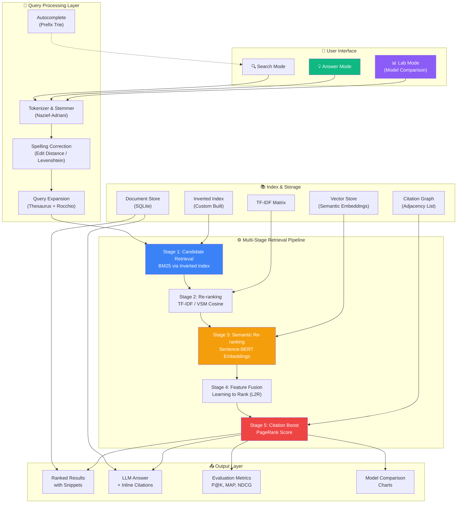
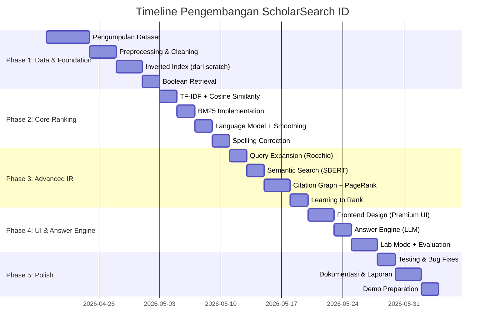

# 🔬 ScholarSearch ID — Answer Engine Jurnal Akademik Indonesia

> **Proyek Akhir Mata Kuliah Temu Kembali Informasi (TKI)**  
> Prodi Teknik Informatika — Universitas Trunojoyo Madura — 2026

---

## 🎯 Mengapa Proyek Ini Akan Membuat Dosen Terkesan?

Dosen IR menilai proyek berdasarkan **3 pilar utama**:

| Pilar | Apa yang Dinilai | Bagaimana Kita Menang |
|-------|-----------------|----------------------|
| 🧠 **Pemahaman Konsep** | Apakah mahasiswa paham teori, bukan cuma pakai library? | Kita **bangun IR pipeline dari nol** (inverted index, BM25, TF-IDF sendiri) |
| 📊 **Rigor Evaluasi** | Apakah ada evaluasi yang proper, bukan asal jalan? | Kita sediakan **dashboard evaluasi lengkap** (P@K, MAP, NDCG) + perbandingan multi-model |
| 🚀 **Inovasi & Kreativitas** | Apakah ada sesuatu yang "wow"? | Kita buat **Answer Engine** mode — user tanya, sistem jawab + kutip sumber paper |

> [!IMPORTANT]
> **Kunci utama**: Proyek ini bukan sekadar "search engine biasa". Ini adalah **sistem IR multi-stage** yang membuktikan kamu memahami SEMUA 12 materi, dengan visualisasi interaktif yang membuat setiap konsep *terlihat jelas* saat demo.

---

## 🏗️ Apa yang Akan Kita Bangun?

### Definisi Singkat

**ScholarSearch ID** adalah sebuah *Answer Engine* dan *Search Engine* khusus untuk pencarian jurnal/paper akademik Indonesia. User bisa:

1. **🔍 Search Mode** — Ketik kata kunci → Dapat daftar paper terranking (seperti Google Scholar)
2. **💡 Answer Mode** — Ketik pertanyaan natural → Dapat **jawaban ringkas + kutipan sumber paper** (seperti Perplexity AI)
3. **📊 Lab Mode** — Bandingkan performa **5 model retrieval** secara side-by-side dengan metrik evaluasi real-time

### Kenapa Domain "Paper Akademik"?

- ✅ **Citation graph** antar paper → **sempurna untuk PageRank** (Materi 12)
- ✅ Paper punya **metadata terstruktur** (judul, abstrak, penulis, tahun, keyword) → mudah di-index
- ✅ Relevan langsung untuk mahasiswa → dosen lihat "ini bermanfaat, bukan cuma tugas"
- ✅ Dataset tersedia dari **Garuda, SINTA, atau OAI-PMH** (jurnal berbasis OJS Indonesia)

---

## 🧬 Arsitektur Sistem Lengkap



---

## 📋 Mapping Detail: Setiap Materi → Fitur Konkret

Inilah yang membuat proyek ini **istimewa** — setiap materi kuliah punya implementasi konkret yang bisa di-demo:

### Materi 1: Pengantar IR
| Implementasi | Detail |
|-------------|--------|
| Arsitektur sistem | Pipeline end-to-end: Input Query → Processing → Retrieval → Ranking → Output |
| Halaman "About" | Menjelaskan konsep IR yang digunakan di sistem |

### Materi 2: Boolean Retrieval & Term Indexing
| Implementasi | Detail |
|-------------|--------|
| **Inverted Index** | Dibangun **dari scratch** menggunakan Python dict/defaultdict — bukan library |
| **Posting List** | Sorted posting list dengan document frequency |
| **Boolean Query** | Support operator AND, OR, NOT pada search |
| **Tokenizer** | Custom tokenizer untuk Bahasa Indonesia (stemming Nazief-Adriani) |

```python
# Contoh implementasi yang akan dibuat
class InvertedIndex:
    def __init__(self):
        self.index = {}       # term -> posting list
        self.doc_freq = {}    # term -> document frequency
        self.doc_lengths = {} # doc_id -> document length
    
    def add_document(self, doc_id, tokens):
        """Bangun index dari tokenized document"""
        ...
    
    def boolean_and(self, term1, term2):
        """Merge intersect dua posting list"""
        ...
```

### Materi 3: Struktur Data & Temu-Kembali Toleran
| Implementasi | Detail |
|-------------|--------|
| **Spelling Correction** | Edit distance (Levenshtein) + suggestion "Did you mean...?" |
| **Autocomplete** | Prefix trie dari vocabulary index |
| **Wildcard Query** | Support query seperti `komput*` → komputasi, komputer, ... |

### Materi 4: Pembobotan Term & VSM
| Implementasi | Detail |
|-------------|--------|
| **TF-IDF** | Implementasi formula TF-IDF dari scratch (log TF, IDF smoothed) |
| **Cosine Similarity** | Ranking dokumen berdasarkan cosine similarity TF-IDF vectors |
| **Visualisasi** | Tampilkan TF-IDF weights per term di result card |

### Materi 5: Temu-Kembali Probabilistik
| Implementasi | Detail |
|-------------|--------|
| **BM25** | Implementasi BM25 (Okapi) dari scratch dengan parameter k1, b tunable |
| **Parameter Tuning** | Slider di UI untuk adjust k1 dan b, lihat efek real-time |
| **Perbandingan** | Side-by-side: BM25 vs TF-IDF pada query yang sama |

```python
# BM25 scoring dari scratch
def bm25_score(query_terms, doc_id, k1=1.5, b=0.75):
    score = 0
    doc_len = doc_lengths[doc_id]
    avg_dl = sum(doc_lengths.values()) / len(doc_lengths)
    
    for term in query_terms:
        if term in inverted_index:
            tf = term_freq(term, doc_id)
            df = doc_freq[term]
            idf = math.log((N - df + 0.5) / (df + 0.5) + 1)
            tf_normalized = (tf * (k1 + 1)) / (tf + k1 * (1 - b + b * doc_len / avg_dl))
            score += idf * tf_normalized
    return score
```

### Materi 6: Pemodelan Bahasa untuk IR
| Implementasi | Detail |
|-------------|--------|
| **Query Likelihood Model** | P(q\|d) dengan unigram language model |
| **Smoothing** | Jelinek-Mercer smoothing + Dirichlet smoothing |
| **Perbandingan** | LM vs BM25 vs TF-IDF pada Lab Mode |

### Materi 7: Ekspansi Query & Umpan-Balik Relevansi
| Implementasi | Detail |
|-------------|--------|
| **Rocchio Algorithm** | User tandai dokumen relevan → query di-reweight otomatis |
| **Pseudo-Relevance Feedback** | Otomatis ambil top-K sebagai "relevan", expand query |
| **Thesaurus Expansion** | Sinonim Bahasa Indonesia untuk expand query terms |
| **UI** | Tombol 👍/👎 di setiap hasil → trigger relevance feedback |

### Materi 8: Temu-Kembali Laten & Semantik
| Implementasi | Detail |
|-------------|--------|
| **Semantic Search** | Gunakan `paraphrase-multilingual-MiniLM-L12-v2` untuk embedding |
| **Cosine Similarity** | Ranking berdasarkan kesamaan embedding query-dokumen |
| **Hybrid Search** | Combine BM25 (sparse) + Embedding (dense) scores |

### Materi 9: Klasifikasi, Klasterisasi & Learning to Rank
| Implementasi | Detail |
|-------------|--------|
| **Topic Classification** | Klasifikasi paper ke topik (Machine Learning, Networking, dll) |
| **K-Means Clustering** | Visualisasi klaster paper di hasil pencarian |
| **Learning to Rank** | Combine features (BM25 + TF-IDF + Semantic + PageRank + Metadata) dengan model supervised |

### Materi 10: Pembelajaran Neural untuk Peringkat
| Implementasi | Detail |
|-------------|--------|
| **Neural Re-ranker** | Simplified cross-encoder menggunakan pre-trained BERT (IndoBERT) |
| **Multi-stage** | BM25 (retrieve top-100) → BERT re-rank (top-10) |

### Materi 11: Evaluasi dalam IR
| Implementasi | Detail |
|-------------|--------|
| **Evaluation Dashboard** | Halaman khusus menampilkan metrik IR |
| **Metrik** | Precision@K, Recall@K, F1, MAP, NDCG, MRR |
| **Perbandingan Model** | Chart/tabel: BM25 vs TF-IDF vs LM vs Semantic vs L2R |
| **Relevance Judgments** | User bisa beri label relevansi → dihitung metriknya |

### Materi 12: Analisis Tautan dalam Pencarian Web
| Implementasi | Detail |
|-------------|--------|
| **Citation Graph** | Graph sitasi antar paper (paper A mengutip paper B) |
| **PageRank** | Hitung PageRank score tiap paper berdasarkan citation graph |
| **HITS** | Hub & Authority scores untuk paper |
| **Visualisasi** | Interactive citation network graph |
| **Ranking Boost** | PageRank score sebagai faktor tambahan di final ranking |

---

## 🖥️ Desain UI / UX

### Halaman Utama — Search & Answer

```
┌─────────────────────────────────────────────────────┐
│  ◉ ScholarSearch ID                    [Lab] [About]│
│─────────────────────────────────────────────────────│
│                                                     │
│         🎓 ScholarSearch Indonesia                  │
│     Temukan Jawaban dari Jutaan Paper Akademik      │
│                                                     │
│  ┌─────────────────────────────────────────────┐    │
│  │ 🔍 Bagaimana pengaruh deep learning          │    │
│  │    terhadap klasifikasi teks bahasa Indonesia?│    │
│  └─────────────────────────────────────────────┘    │
│                                                     │
│   [🔍 Search Mode]    [💡 Answer Mode]              │
│                                                     │
│   Did you mean: "deep learning" → "deep learning"   │
│   Query expanded: +neural +network +NLP              │
│                                                     │
│ ─ ─ ─ ─ ─ ─ ─ ─ ─ ─ ─ ─ ─ ─ ─ ─ ─ ─ ─ ─ ─ ─ ─  │
│                                                     │
│  💡 ANSWER (Answer Mode):                           │
│  ┌─────────────────────────────────────────────┐    │
│  │ Deep learning telah menunjukkan peningkatan  │    │
│  │ signifikan dalam klasifikasi teks bahasa     │    │
│  │ Indonesia, terutama melalui model IndoBERT   │    │
│  │ [1][2]. Penelitian oleh Wilie et al. (2020)  │    │
│  │ menunjukkan akurasi 92.3% pada dataset       │    │
│  │ IndoNLU [1], sementara pendekatan CNN-LSTM   │    │
│  │ mencapai F1-score 0.89 [3]...                │    │
│  │                                              │    │
│  │ 📚 Sumber:                                   │    │
│  │ [1] Wilie et al. - IndoNLU (2020)            │    │
│  │ [2] Koto et al. - IndoBERT (2021)            │    │
│  │ [3] Purwarianti - CNN-LSTM Teks ID (2019)    │    │
│  └─────────────────────────────────────────────┘    │
│                                                     │
│  📋 SEARCH RESULTS:                                 │
│  ┌─────────────────────────────────────────────┐    │
│  │ 📄 #1  IndoNLU: Benchmark and Resources...   │    │
│  │ 👤 Wilie, Vincentio, et al. │ 📅 2020        │    │
│  │ 📊 BM25: 12.4 │ PageRank: 0.034 │ 👍 👎     │    │
│  │ TF-IDF: {deep:0.23, learning:0.19, ...}     │    │
│  └─────────────────────────────────────────────┘    │
│  ┌─────────────────────────────────────────────┐    │
│  │ 📄 #2  IndoBERT: A Pre-trained Language...   │    │
│  │ 👤 Koto, Fajri, et al. │ 📅 2021             │    │
│  │ 📊 BM25: 11.8 │ PageRank: 0.029 │ 👍 👎     │    │
│  └─────────────────────────────────────────────┘    │
└─────────────────────────────────────────────────────┘
```

### Halaman Lab Mode — Model Comparison

```
┌─────────────────────────────────────────────────────┐
│  ◉ ScholarSearch ID              [Lab ●] [Home]     │
│─────────────────────────────────────────────────────│
│  🧪 IR Lab: Bandingkan Model Retrieval              │
│                                                     │
│  Query: [deep learning klasifikasi teks         ]   │
│                                                     │
│  ☑ TF-IDF  ☑ BM25  ☑ Language Model                │
│  ☑ Semantic  ☑ L2R (Combined)                       │
│                                                     │
│  BM25 Parameters: k1=[1.5▼] b=[0.75▼]              │
│                                                     │
│  ┌──────────────────────────────────────────────┐   │
│  │  📊 Evaluation Metrics                        │   │
│  │  ┌────────┬───────┬───────┬──────┬──────────┐│   │
│  │  │ Model  │ P@5   │ P@10  │ MAP  │ NDCG@10  ││   │
│  │  ├────────┼───────┼───────┼──────┼──────────┤│   │
│  │  │ TF-IDF │ 0.60  │ 0.45  │ 0.52 │ 0.61     ││   │
│  │  │ BM25   │ 0.80  │ 0.65  │ 0.71 │ 0.78     ││   │
│  │  │ LM     │ 0.70  │ 0.55  │ 0.63 │ 0.70     ││   │
│  │  │ Semant │ 0.80  │ 0.70  │ 0.74 │ 0.82     ││   │
│  │  │ L2R    │ 0.90  │ 0.80  │ 0.85 │ 0.91     ││   │
│  │  └────────┴───────┴───────┴──────┴──────────┘│   │
│  │                                               │   │
│  │  [📈 Precision-Recall Curve]  [📊 NDCG Bar]   │   │
│  └──────────────────────────────────────────────┘   │
│                                                     │
│  Side-by-Side Results:                              │
│  ┌─── BM25 ───┐  ┌─── Semantic ─┐  ┌─── L2R ────┐ │
│  │ 1. Paper A  │  │ 1. Paper C   │  │ 1. Paper A  │ │
│  │ 2. Paper B  │  │ 2. Paper A   │  │ 2. Paper C  │ │
│  │ 3. Paper D  │  │ 3. Paper B   │  │ 3. Paper B  │ │
│  └─────────────┘  └──────────────┘  └─────────────┘ │
└─────────────────────────────────────────────────────┘
```

### Halaman Citation Network

```
┌─────────────────────────────────────────────────────┐
│  ◉ ScholarSearch ID          [Citation Graph]       │
│─────────────────────────────────────────────────────│
│                                                     │
│   Interactive Citation Network (D3.js)              │
│  ┌──────────────────────────────────────────────┐   │
│  │                                              │   │
│  │        [Paper A] ──→ [Paper D]               │   │
│  │          ↑    ↘                               │   │
│  │     [Paper B]  [Paper C] ──→ [Paper E]       │   │
│  │          ↑        ↗                           │   │
│  │        [Paper F]                              │   │
│  │                                              │   │
│  │  🔴 PageRank tinggi   🔵 PageRank rendah     │   │
│  │  Node size = PageRank score                  │   │
│  └──────────────────────────────────────────────┘   │
│                                                     │
│  Top Papers by PageRank:                            │
│  1. Paper D (PR: 0.089) — Hub paper                 │
│  2. Paper A (PR: 0.067) — Authority paper           │
└─────────────────────────────────────────────────────┘
```

---

## 🛠️ Tech Stack Detail

| Layer | Teknologi | Alasan |
|-------|-----------|--------|
| **Frontend** | HTML + CSS + Vanilla JS | Ringan, tanpa framework — fokus pada konten IR |
| **Charting** | Chart.js | Grafik evaluasi (P-R curve, bar chart NDCG) |
| **Graph Viz** | D3.js / vis.js | Visualisasi citation network |
| **Backend** | Python Flask / FastAPI | Ecosystem NLP Python paling kaya |
| **Index** | **Custom dari scratch** | Inverted index, TF-IDF, BM25 — **BUKAN** library |
| **Semantic** | `sentence-transformers` | Model multilingual untuk embedding Bahasa Indonesia |
| **Stemmer** | Sastrawi (Nazief-Adriani) | Stemmer Bahasa Indonesia |
| **LLM** | Google Gemini API (free) | Answer generation dengan kutipan |
| **Database** | SQLite | Metadata paper, relevance judgments |
| **Evaluasi** | Custom module | P@K, MAP, NDCG, MRR — dari scratch |

---

## 📂 Strategi Pengumpulan Data

### Opsi Dataset (pilih salah satu atau kombinasi):

| Sumber | Jumlah | Cara Akses | Kelebihan |
|--------|--------|-----------|-----------|
| **Garuda (kemdikbud)** | 500-1000 paper | OAI-PMH harvesting atau scraping metadata | Jurnal Indonesia resmi |
| **ArXiv Indonesia subset** | 200-500 paper | API ArXiv filter author Indonesia | Paper berkualitas tinggi |
| **Repositori UTM** | 300-500 tugas akhir | Scraping abstrak dari repository kampus | Sangat relevan untuk demo |
| **Dataset Kaggle** | Varies | Download langsung | Sudah terstruktur |
| **Manual collection** | 100-200 paper | Kumpulkan PDF + ekstrak teks | Kontrol penuh |

### Data yang Dibutuhkan per Paper:
```json
{
    "id": "paper_001",
    "title": "Analisis Sentimen Menggunakan IndoBERT",
    "abstract": "Penelitian ini mengkaji...",
    "authors": ["Budi Santoso", "Ani Wijaya"],
    "year": 2023,
    "keywords": ["sentiment analysis", "NLP", "IndoBERT"],
    "journal": "Jurnal Informatika UTM",
    "full_text": "...",
    "citations": ["paper_005", "paper_012", "paper_089"],
    "url": "https://..."
}
```

---

## 📅 Timeline Implementasi



---

## 🏆 Faktor "Wow" yang Akan Membuat Dosen Terkesan

### 1. 🧪 Lab Mode — Interactive Model Comparison
> Dosen bisa **langsung bandingkan** 5 model IR (TF-IDF, BM25, LM, Semantic, L2R) pada query yang sama, lihat ranking berubah dan metrik evaluasi real-time.
> 
> *"Ini menunjukkan mahasiswa benar-benar paham perbedaan tiap model, bukan hanya teori."*

### 2. 📐 From-Scratch Implementation
> Inverted index, BM25, TF-IDF, dan evaluasi metrik dibangun **dari nol tanpa library IR** (bukan Elasticsearch/Whoosh/Pyserini). Kode bisa ditunjukkan dan dijelaskan baris per baris.
>
> *"Ini membuktikan pemahaman mendalam, bukan sekadar memanggil API."*

### 3. 🔄 Multi-Stage Pipeline
> Retrieval dilakukan bertahap: BM25 → Re-rank (TF-IDF) → Semantic → L2R → PageRank boost. Ini mendemonstrasikan **arsitektur IR modern** yang sebenarnya dipakai di industri.

### 4. 💡 Answer Engine dengan Citation
> User tanya pertanyaan → Sistem jawab dengan paragraf ringkas + **inline citation [1][2][3]** yang bisa di-klik. Ini fitur yang sangat "kekinian" dan menunjukkan integrasi IR + NLG.

### 5. 🕸️ Citation Network Visualization
> Visualisasi interaktif graph sitasi antar paper. Node yang besar = PageRank tinggi. Dosen bisa klik paper dan lihat hubungan sitasi.

### 6. 📊 Evaluation Dashboard yang Komprehensif
> Bukan cuma bilang "akurasi 90%". Tapi menampilkan **P@5, P@10, MAP, NDCG@10, MRR**, precision-recall curve, dan perbandingan antar model dalam tabel dan grafik.

### 7. 👍👎 Interactive Relevance Feedback
> User bisa klik 👍 atau 👎 pada hasil pencarian, dan sistem akan **otomatis re-rank menggunakan Rocchio algorithm**. Ini demonstrasi langsung Materi 7.

### 8. 🎛️ Parameter Tuning Live
> Slider untuk BM25 parameters (k1, b) dan LM smoothing (λ, μ) — hasil berubah real-time saat di-geser. Dosen bisa "bermain" dengan parameter dan lihat efeknya.

---

## 📁 Struktur Proyek

```
ScholarSearchID/
├── app.py                      # Flask main app
├── requirements.txt
├── config.py
│
├── data/
│   ├── papers.json             # Dataset paper
│   ├── citations.json          # Citation graph
│   └── stopwords_id.txt        # Stopwords Bahasa Indonesia
|
├── scraper/                    # Biar data up-to-date
│   └── garuda_scraper.py
|
├── core/                       # 🧠 IR Engine (SEMUA dari scratch)
│   ├── __init__.py
│   ├── tokenizer.py            # Tokenizer + Stemmer Indonesia
│   ├── inverted_index.py       # Inverted Index (Materi 2)
│   ├── spelling.py             # Spelling Correction (Materi 3)
│   ├── tfidf.py                # TF-IDF + Cosine (Materi 4)
│   ├── bm25.py                 # BM25 Okapi (Materi 5)
│   ├── language_model.py       # Query Likelihood + Smoothing (Materi 6)
│   ├── query_expansion.py      # Rocchio + Thesaurus (Materi 7)
│   ├── semantic_search.py      # Sentence-BERT (Materi 8)
│   ├── learning_to_rank.py     # L2R Feature Combo (Materi 9)
│   ├── neural_ranker.py        # BERT Re-ranker (Materi 10)
│   ├── evaluation.py           # P@K, MAP, NDCG (Materi 11)
│   └── pagerank.py             # PageRank + HITS (Materi 12)
│
├── answer_engine/
│   ├── __init__.py
│   └── generator.py            # LLM answer generation
│
├── static/
│   ├── css/
│   │   └── style.css           # Premium dark-mode UI
│   ├── js/
│   │   ├── app.js              # Main app logic
│   │   ├── search.js           # Search interaction
│   │   ├── lab.js              # Lab mode charts
│   │   └── citation_graph.js   # D3.js citation network
│   └── img/
│
├── templates/
│   ├── index.html              # Home / Search page
│   ├── lab.html                # Lab Mode
│   ├── citation.html           # Citation Network
│   └── about.html              # About page
│
└── tests/
    ├── test_index.py
    ├── test_bm25.py
    └── test_evaluation.py


